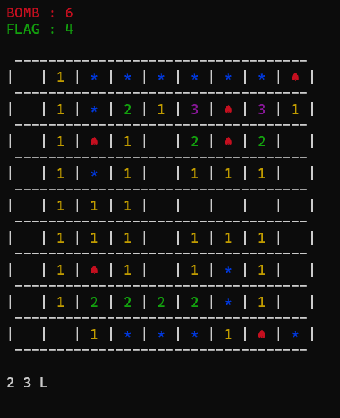
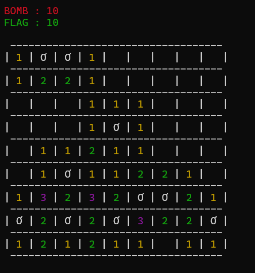
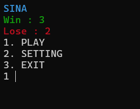

# Minesweeper

## Table of Contents
- [About](#about)
- [Installation](#installation)
- [How to Play](#how-to-play)
- [Cheat](#cheat)

## About
[Minesweeper](https://en.wikipedia.org/wiki/Minesweeper_(video_game)) is a classic puzzle game that challenges players to uncover a grid of hidden mines using logic and reasoning. The goal is to clear the entire grid without triggering any mines. Each revealed tile shows a number representing how many adjacent tiles contain mines, helping players deduce safe tiles to uncover next.

This version of Minesweeper is fully implemented in C, providing a lightweight, efficient, and fast solution that runs in the terminal or command-line interface.

## Installation
To compile and run Minesweeper on your local machine, follow these steps:

### Prerequisites
- A C compiler, such as `gcc`, should be installed on your system. If you don't have it installed, you can get it by following the appropriate instructions for your platform:
  - **Linux**: Install via package manager, e.g., `sudo apt install gcc`.
  - **Windows**: You can install `gcc` through [MinGW](https://sourceforge.net/projects/mingw/) or use an IDE like Microsoft Visual Studio.

### Steps

1. **Clone the repository:**
   Open your terminal and run the following command to clone the Minesweeper project repository:

   ```bash
   git clone https://github.com/SINA-JAHANGIR/Minesweeper.git
   ```

2. **Navigate to the project directory:**
   Change to the directory where the code was cloned:

   ```bash
   cd /path/to/minesweeper
   ```

3. **Compile the program:**
   Compile the Minesweeper code using `gcc` or another C compiler:

   ```bash
   gcc -o minesweeper minesweeper.c
   ```

4. **Run the game:**
   After compiling, run the executable to start playing:

   ```bash
   ./minesweeper
   ```


## How to Play

To play the Minesweeper game, follow these steps:

1. **Input Position:** The game board is represented in a grid format. You need to specify the position you want to interact with by entering the row and column numbers. For example, to select the cell in row 2 and column 3, you would enter `2 3`.

2. **Choose Click Type:**
   - After specifying the position, you must indicate the type of click you want to perform:
     - **Left Click:** To uncover the cell, use the letter `L`.
     - **Right Click:** To mark the cell (usually for suspected mines), use the letter `R`.

3. **Example Input:**
   - To perform a left click on the cell at row 2 and column 3, you would enter:  
     ```
     2 3 L
     ```
   - To perform a right click on the cell at row 1 and column 8, you would enter:  
     ```
     1 8 R
     ```

4. **Gameplay:** Continue selecting positions and clicking until you either uncover all safe cells or hit a mine.

5. **Winning the Game:** The objective is to uncover all the cells without triggering any mines. If you manage to do so, you win!

6. **Ending the Game:** The game ends if you trigger a mine or successfully uncover all the safe cells.

## Cheat

If you're curious to explore the game without the usual challenges, you can use cheat codes to gain an advantage. At any point during the game, you can enter `I AM JAVAD` instead of the game's inputs, to reveal all mine locations on the board and automatically win. 

### Note:
*Please be careful: never sign in with the `TA` for name.*

Enjoy your game!






