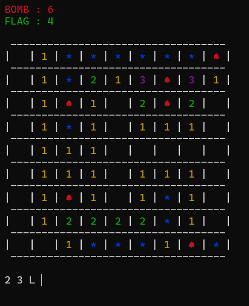
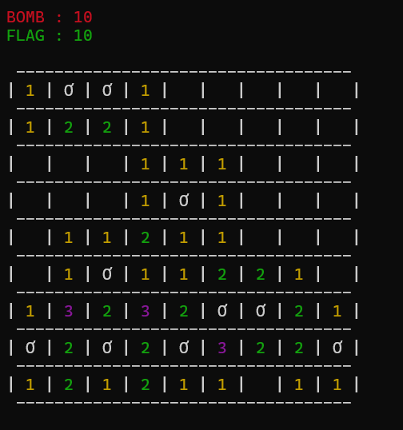
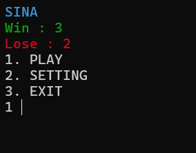

# Console-Minesweeper-Game

An interactive, colorful, and feature-rich Minesweeper game built from scratch in C. Designed to run in the Windows console, this application features dynamic board generation, recursive cell-revealing algorithms, ANSI color styling, Unicode symbol support, and built-in Easter eggs.

> 🎓 **Academic Project:** This project was developed as a mini-project for the **Basics of Programming (BP)** course during my university studies to demonstrate core programming paradigms in C.

---

## About
[Minesweeper](https://en.wikipedia.org/wiki/Minesweeper_(video_game)) is a classic puzzle game that challenges players to uncover a grid of hidden mines using logic and reasoning. The goal is to clear the entire grid without triggering any mines. Each revealed tile shows a number representing how many adjacent tiles contain mines, helping players deduce safe tiles to uncover next.

---
## 🕹️ How to Play

Upon starting, enter your name and select **PLAY** -> **SMALL LAND (9x9)** from the menu.

When prompted on the board, you must enter your move using the following format:
`[Row] [Column] [Action]`

*   **Row:** `1` to `9`
*   **Column:** `1` to `9`
*   **Action:** 
    *   `L` (Left Click) to **Reveal** a cell.
    *   `R` (Right Click) to **Flag/Unflag** a cell.

### Example Inputs:
*   `3 4 L` $\rightarrow$ Reveals the cell at Row 3, Column 4.
*   `5 5 R` $\rightarrow$ Places/Removes a Flag at Row 5, Column 5.
*   `E N D` $\rightarrow$ Forcefully exits the current match.

---

## 🖥️ Compilation and Running

```bash
# Compile the game
gcc -o minesweeper Minesweeper.c

# Run the executable
./minesweeper

```

---

## 🎮 Secrets & Cheats

* **`I AM JAVAD`** $\rightarrow$ Enter this instead of coordinates to instantly reveal all mines and win the game.
* **The Anti-TA Lock** $\rightarrow$ Signing in with the name `TA` triggers an instant, playful game over with a lockout message.

---







